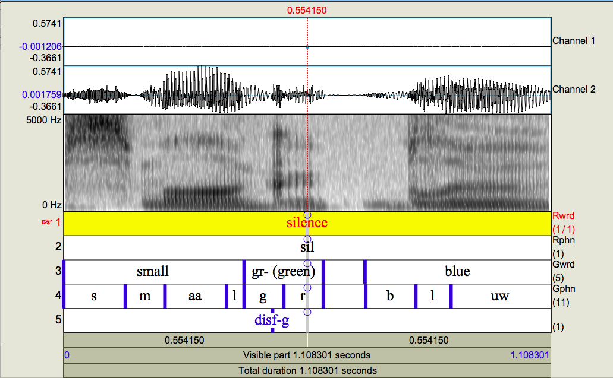

# GridParser
### A Python Script that extracts Structured Data from Praat TextGrids

Praat (a phonetic analysis tool) is often used to label snippets of audio, allowing the user to annotate arbitrary time intervals of audio. Short of writing a Praat script, however, there is no way for users to programatically sift the notes they made on a particular piece of audio. 

The Grid Parser solves this problem by converting a Praat TextGrid (the text file that contains all the user's annotations) to a Python Dictionary. 

### Documentation
Consider the following annotations on a two-channeled audio file:


Note that in this particular audio file, there are 5 labelling tiers - the first 4 are interval tiers, and the fifth is a point tier. 

#### `gridParser.parseFile(filename)`
Extracts the annotations of "filename" (a `.TextGrid` file) into a python dictionary of the following form:
```python
{
   File type: "ooTextGrid" (string),
   Object class: "TextGrid" (string),
   xmin: time at beginning of audio (string),
   xmax: time at end of audio (string),
   size: the integer number of tiers in the file (string),
   item: a list, wherein each element is a single tier of annotations (list)
}
``` 

Here is how the parser can be used on the TextGrid file corresponding to the figure above:

```python
>>> import gridParser
>>> parsed = gridParser.parseFile('97_1-disf-56s.TextGrid')
>>>
>>>
>>> parsed['item'][0]['intervals']
   [{'xmin': '0', 'text': '"silence"', 'xmax': '1.4174919078381478'}]
>>> parsed['item'][1]['intervals']
   [{'xmin': '0', 'text': '"sil"', 'xmax': '1.4174919078381478'}]
>>> parsed['item'][4]['points']
   [{'number': '0.6845761947773994', 'mark': '"disf-g"'}]
```
Note: The 0th element of `parsed['item']` corresponds to the first tier, the 1st to the second tier, and so on. Also note that you access point tier data with the dict key `'points'` as opposed to `'intervals'`.

### Gotchas

When using `parseFile()`, make sure that the TextGrid you are parsing is tab delimited. You will most likely get an error if it is space delimited. 


   
   


